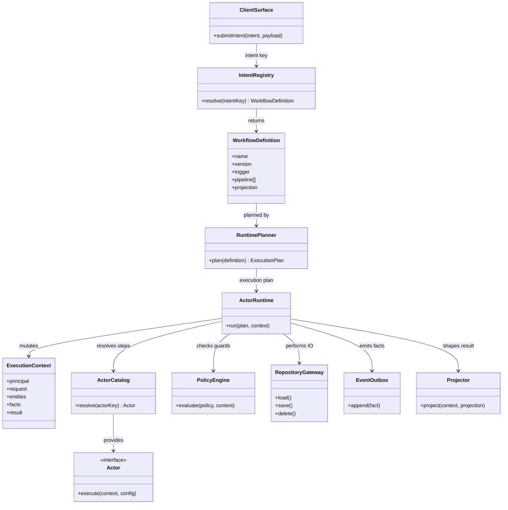
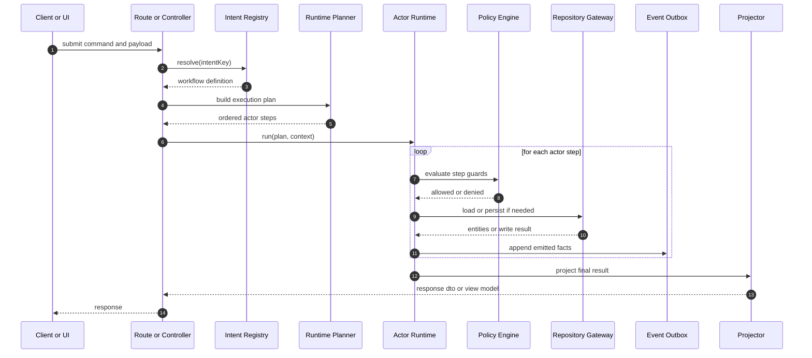

# Actor Runtime Architecture

This document describes the target architecture for SpotOnSight if the system is optimized around reusable actors and business-data-driven behavior.

## Intent

The core idea is:

- actors do not encode business features directly
- business data declares which actors are needed
- orchestration composes actors atomically per request, workflow, or screen
- feature growth comes primarily from new business data and policies, not new actor variants

This is the right direction when multiple features share the same underlying capabilities such as validate, authorize, load, enrich, persist, notify, moderate, and project.

## Atomic Split

The split should be made by execution responsibility, not by feature name.

- `Intent definitions`: describe what the workflow is trying to achieve
- `Business policies`: rules, thresholds, visibility, moderation, permissions, and required side effects
- `Actor catalog`: reusable units that each do one kind of work well
- `Runtime planner`: reads business data and selects actors in order
- `Execution context`: carries request state, principal, ids, loaded entities, and intermediate results
- `Repositories and gateways`: persistence and external IO only
- `Projectors`: shape results for API or UI consumption

If an actor needs to know it is specifically handling "spots", "support", or "meetups", the split is not atomic enough. The actor should know its capability, while the business data should define the domain-specific rules.

## Actor Contract

Each actor should be generic and small enough to be reasoned about in isolation.

- input: execution context plus actor config
- output: context mutations and explicit emitted facts
- side effects: only through declared repositories or gateways
- guarantees: idempotent where possible, deterministic for the same context and config

Good actors:

- `LoadEntityActor`
- `AuthorizeActor`
- `NormalizeInputActor`
- `PersistEntityActor`
- `CreateRelationActor`
- `DeleteRelationActor`
- `EmitNotificationActor`
- `ApplyModerationActor`
- `ProjectResponseActor`

Bad actors:

- `CreateSpotWithFollowersAndNotificationsActor`
- `HandleAdminSupportAndModerationActor`

Those are feature scripts, not reusable actors.

## Business Data Shape

Business data should decide orchestration using declarative workflow definitions such as:

- workflow name and version
- trigger type
- required entities
- actor chain
- actor config per step
- guard policies
- compensation or rollback policy
- result projection

Example shape:

```json
{
  "workflow": "social.spot.create",
  "version": 3,
  "trigger": "api.command",
  "pipeline": [
    { "actor": "normalize-input", "config": { "schema": "SpotUpsert" } },
    { "actor": "authorize", "config": { "policy": "can_post" } },
    { "actor": "persist-entity", "config": { "repository": "spots", "mode": "create" } },
    { "actor": "apply-moderation", "config": { "policy": "new_spot_default" } },
    { "actor": "project-response", "config": { "projection": "spot_public" } }
  ]
}
```

The workflow above is business data. The actor implementations stay reusable.

## Component UML



## Orchestration Sequence UML



## Why This Split Is Better

- It localizes change pressure into business definitions instead of duplicating orchestration code.
- It makes behavior inspectable: the workflow can be read as data.
- It reduces feature branching in the codebase because actors are capability-based.
- It improves testing because actors, policies, and workflow definitions can each be verified independently.
- It allows controlled evolution: new features often become new workflow data plus maybe one new actor, not another feature silo.

## Guardrails

This style only stays healthy if the boundaries are strict.

- actors must remain capability-scoped and not grow feature branches
- workflow data must stay declarative and not become hidden code blobs
- policy evaluation must be explicit and testable
- repositories must not absorb orchestration logic
- projectors must shape outputs, not mutate business state

## How This Maps To Current SpotOnSight

The codebase now reflects much of this direction:

- backend route composition is declared through explicit route manifests instead of generic CRUD registration
- backend social behavior is split into focused action modules plus reusable workflow/runtime helpers
- frontend composition is owned by actor manifests and instance-scoped UI/runtime registries
- frontend actions own orchestration and state mutation while services stay focused on IO

## Recommended Refactor Direction

1. Define a stable `ExecutionContext` contract shared by backend workflows.
2. Extract actor interfaces and a runtime from feature-heavy service code.
3. Move workflow definitions into dedicated business-data modules.
4. Move policy logic into explicit policy modules.
5. Keep DTOs, repositories, and projectors separate from orchestration.

That structure preserves your vision: write actors once, reuse them everywhere, and let business data decide which actors run and why.

For the concrete migration sequence in this repository, see `docs/architecture/actor-refactor-map.md`.
